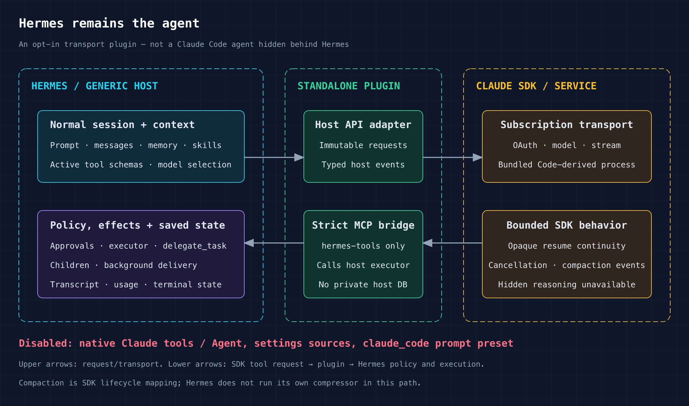
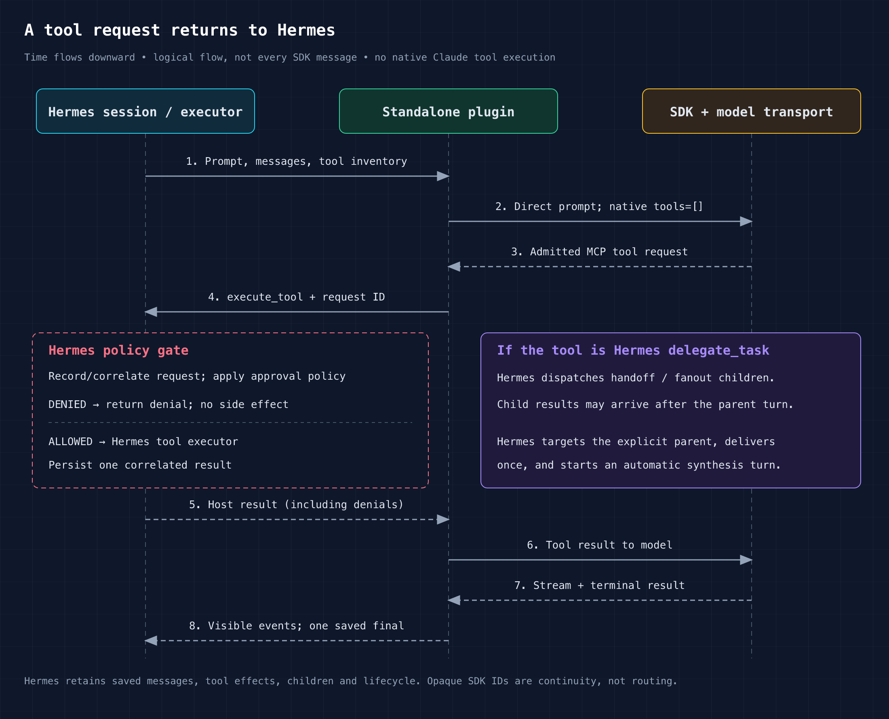

# Maintainer guide: Claude subscription transport for Hermes

> **Current unreleased phase:** [Plugin UX recovery](plugin-ux-recovery.md)
> improves the standalone path without claiming ordinary-model-loop ownership.
> Its first installed tool/approval/persistence/restart check passes; remaining
> acceptance and CI are pending. The release history below does not qualify
> this successor, and the successor does not repair existing downloads.

> **Correction — 2026-09-09:** the intent below is not achieved by v0.1.0.
> The whole-turn path bypasses normal model hooks/budgets; native history and
> compaction remain authoritative. Intermediate commentary is not fully saved,
> request accounting is unsupported, and tool text/schema conversions are lossy.
> The actual Hermes executor, tool hooks and approvals do work.
> See the [frozen investigation](ownership-recovery/investigation.md) and
> [recovery tracker](https://github.com/100yenadmin/hermes-claude-agent-sdk/issues/1).
> Qualification and diagrams below are historical, not proof of complete ownership.
> Any future full-ownership claim still requires the unresolved generation
> admission and ordinary-loop work in issues #21 and #22.

**The intent:** use a Claude subscription in normal Hermes without replacing
Hermes with Claude Code's agent. This is an opt-in standalone plugin plus a
provider-neutral host interface, not a change to Hermes' ordinary API providers.

**Distribution:** [v0.1.0 on GitHub Releases](https://github.com/100yenadmin/hermes-claude-agent-sdk/releases/tag/v0.1.0)
is the pinned-host distribution target and authoritative publication record.
The plugin implementation is merged; the Hermes host PR still requires upstream
acceptance. Stock Hermes is not supported by this release. The recorded RC
passed release qualification and a separate 100-turn isolated runtime campaign;
the GA release attaches its own artifact/version-delta and smoke verification.

## Review in this order

1. **Host boundary:** [Hermes PR #101052](https://github.com/NousResearch/hermes-agent/pull/101052)
   and its [AgentRuntime v1 ADR](https://github.com/NousResearch/hermes-agent/blob/80332e62eb19e48ed4a1c220dc4c06fe343418ac/docs/adr/agent-runtime-v1.md).
   Review `agent/runtime_api.py`, `agent/runtime_dispatch.py`, runtime
   registration, and Gateway persistence. The seam lets a whole-turn transport
   call Hermes' executor and emit typed events without access to `AIAgent`,
   `SessionDB`, or private Gateway routing. It carries no Claude SDK or OAuth policy.
2. **Plugin boundary:** [PR #10](https://github.com/100yenadmin/hermes-claude-agent-sdk/pull/10),
   especially [configuration](../src/hermes_claude_agent_sdk/configuration.py),
   [runtime bridge](../src/hermes_claude_agent_sdk/runtime.py),
   [auth](../src/hermes_claude_agent_sdk/auth.py), and
   [billing](../src/hermes_claude_agent_sdk/billing.py).
   Registration is lazy; SDK/auth/process work starts only after selection and compatibility admission.
3. **Proof, not benchmark arithmetic:** read [H1–H8 acceptance](../qa/hermes-release-acceptance.md)
   and the evidence table below. The old 220/220 benchmark barrier was explicitly
   superseded, not passed. Foreign OpenClaw features were not added to Hermes.

The maintainer ask is to review the generic host seam and the standalone
consumer separately. A host without the required seam cannot use this plugin.
Upstream merging and expansion of supported models/platforms remain separate decisions.

## What owns what?



[Editable SVG](diagram/ownership.svg).

Hermes constructs the system prompt, exposes tools, handles approvals and
execution, and runs memory/skills and `delegate_task`. The plugin bridges those
tools through MCP. Tool calls/results and final answers are saved, but
intermediate commentary is incomplete. Native history, compaction and internal
generation scheduling remain SDK-owned; the historical diagram overstates that
boundary. Tool descriptions/results and schemas also undergo the lossy
conversions documented in the investigation.

The SDK **does use a bundled Claude Code-derived subprocess**. This design
cannot satisfy a requirement for no such process. It passes `tools=[]`,
`setting_sources=[]`, and the direct Hermes prompt—not the `claude_code`
preset. Native Claude Bash/Read/Write/Edit/Web/Agent tools are not exposed.
`bypassPermissions` suppresses the SDK approval UI only: Hermes still approves
or denies each effect inside its own executor.



[Editable SVG](diagram/request-flow.svg).

Time flows downward: Hermes starts the turn; the SDK requests an admitted MCP
tool; Hermes records/correlates the request and applies policy. A denial returns
without the effect. An allowed call uses Hermes' executor, including native
delegation when the tool is `delegate_task`. Child completion can arrive later:
Hermes delivers it to the explicit parent and starts synthesis. Tool results,
children, and final output remain in Hermes state—not an invisible native Agent.

**Important limits:** hidden provider reasoning is not observable. Compaction
maps SDK `PreCompact`/`compact_boundary` events into generic lifecycle events;
this path does not run Hermes' own compressor. Exact prose, token accounting,
provider internals, arbitrary models, and future versions are not parity claims.
See [architecture](architecture.md) and [security](subscription-only-security.md).

## Try the pinned-host release in isolation

Prerequisites: Git, Python 3.11–3.13, a Claude subscription entitled to the exact
model below, and an isolated Hermes environment. Do not replace your normal
Hermes installation or clone customer credentials/state. The live qualification
was on macOS; Linux CI is deterministic proof, not live Linux/Windows qualification.

### 1. Install the exact host and an identified plugin wheel

In a new scratch directory, create a separate host checkout/virtual environment:

```sh
git clone https://github.com/NousResearch/hermes-agent.git hermes-subscription-review
cd hermes-subscription-review
git fetch origin 80332e62eb19e48ed4a1c220dc4c06fe343418ac
git checkout --detach 80332e62eb19e48ed4a1c220dc4c06fe343418ac
python3.11 -m venv .venv
. .venv/bin/activate
python -m pip install -e .
```

Download `hermes_claude_agent_sdk-0.1.0-py3-none-any.whl` and `SHA256SUMS`
from the [v0.1.0 release](https://github.com/100yenadmin/hermes-claude-agent-sdk/releases/tag/v0.1.0).
In the download directory, compare the following output with the exact wheel
line in `SHA256SUMS`. **Stop on any mismatch before running pip.** Then use the
same isolated virtual environment:

```sh
shasum -a 256 /absolute/path/to/hermes_claude_agent_sdk-0.1.0-py3-none-any.whl
python -m pip install /absolute/path/to/hermes_claude_agent_sdk-0.1.0-py3-none-any.whl
hermes-claude-agent-sdk doctor --json
```

Replace `/absolute/path/to` with your downloaded artifact directory. The
GA hash is published with the release, not the historical RC hash below.
The sdist and sanitized verification receipt are available there too. If the
release is unavailable, stop rather than substituting an unverified package
from an index. Doctor must report `compatible`; it
checks the host handshake offline, **not** login, model access, or live billing.

### 2. Select a dedicated profile and subscription login

Use a fresh profile name; do not clone your default profile:

```sh
hermes profile create subscription-review --no-alias
hermes --profile subscription-review plugins enable claude-agent-sdk --no-allow-tool-override
hermes --profile subscription-review config set model.provider claude-agent-sdk
hermes --profile subscription-review config set model.default claude-fable-5-1
hermes --profile subscription-review config set model.supports_vision true
```

Authenticate with the ordinary Claude subscription login as the same OS user
that will run Hermes. If already signed in, do not sign in again. Otherwise,
run `claude auth login` interactively and finish the browser login yourself.
If no system `claude` command is installed, invoke the SDK's bundled login
from the same virtual environment instead:

```sh
python -c 'import subprocess; from hermes_claude_agent_sdk.compatibility import resolve_bundled_cli; cli=resolve_bundled_cli(); assert cli, "Bundled CLI missing"; raise SystemExit(subprocess.call([cli, "auth", "login"]))'
```

A system CLI, if used, is for login only; the plugin always uses the pinned
SDK's bundled executable for its auth probe and model transport. Keep the same
Claude configuration location if you use a custom one.

This is **not** Hermes' Anthropic API-key provider, and no token should be pasted
into Hermes configuration. Do not enable Extra Usage or configure a paid fallback.
Check only the sanitized auth category in the plugin environment:

```sh
python -c 'from hermes_claude_agent_sdk.auth import probe_claude_auth; r=probe_claude_auth(); print(r.category.value); raise SystemExit(0 if r.allowed else 1)'
```

Expected: `subscription_oauth`. This checks login classification without a model
turn; it does not guarantee model entitlement or current quota. Stop on another
category rather than switching billing routes. See [licensing and terms](licensing-and-terms.md):
technical success does not certify service-terms permission or future entitlement.

### 3. Verify a normal Hermes session

```sh
hermes --profile subscription-review chat
```

Use harmless content in a scratch project. Ask for one Hermes tool read, inspect
its actual result, deny a requested side effect, and verify that it did not
happen. Then allow a separate harmless action. Save/close and resume the same
session, check its messages/results, and try Hermes `delegate_task` with two
small read-only children. Attach a sanitized image if testing vision.

When using Hermes Desktop/TUI, point it at this exact environment and profile;
do not assume an unrelated installed app uses this Python or candidate. The
normal Gateway entrypoint is `python -u -m tui_gateway.entry`. The
[Gateway handoff](installed-hermes-session-handoff.md) explains durable
`stored_session_id` versus the transient live handle. Verify a **non-hidden,
message-bearing session** in normal session state/UI. Its separate zero-model
discovery test is not live model proof.

Expected: Hermes-visible tools, approvals, child results, saved messages and
one terminal per turn; no Claude-native Agent events or silent fallback. Inspect
the actual effect and saved state, not just the model saying it succeeded.
Use `model.supports_vision=true` only while the selected model supports images.
Optional external tools need their own configuration and are not implied tested.

### 4. Disable or remove

```sh
hermes --profile subscription-review plugins disable claude-agent-sdk
python -m pip uninstall -y hermes-claude-agent-sdk
```

Stop this review session first. Uninstall affects the isolated virtual
environment, while enable/disable is profile-scoped. Keep `state.db`, saved
messages, and shared Claude login data. Disabling retains ordinary Hermes
providers; a saved plugin session cannot continue through an absent runtime.
For rollback, reinstall the previously identified wheel and re-enable only the
review profile. See [removal and rollback](removal-and-rollback.md).

## Qualified candidate and proof

The table below preserves the original RC qualification identity. GA v0.1.0 has
a separate source SHA, wheel/sdist hashes and version-delta receipt in its
[release verification](https://github.com/100yenadmin/hermes-claude-agent-sdk/releases/tag/v0.1.0).
GA CI checks out host `80332e6`; the historical RC CI host remains `e89d36a`.
The historical 100-turn run is reused with explicit lineage, not rerun or restamped.

| Identity | Qualified value |
| --- | --- |
| Plugin source | `9a337b04aff73ebe4f9e9dd45d3699e2d3aa40b6` |
| Live host | `80332e62eb19e48ed4a1c220dc4c06fe343418ac` |
| Plugin CI host | `e89d36a38fbb86b33d685ccf3a57f0557b891069` |
| SDK / bundled CLI / model | `0.2.151` / `2.1.258` / `claude-fable-5-1` |
| Installed wheel SHA-256 | `3ad8113e690212ff630de230c213e85746e851d43e5fee0e1b4876e729e04dc8` |
| Runtime payload manifest SHA-256 | `a9cac8f84c53ec17ada8a006958d05ce688a5a1c085b16a8d3b17496d34000e2` |

| Evidence | Result and public record |
| --- | --- |
| Installed Hermes, policy, persistence, delegation, inventory | [Release #9](https://github.com/100yenadmin/hermes-claude-agent-sdk/issues/9): admitted core 112 paths/222 packets; configured inventory distinguishes 19 delivered schemas from 33 executable tools. Historical cohorts retain their identities. |
| Images | [Strict 3/3 native-image proof](https://github.com/100yenadmin/hermes-claude-agent-sdk/issues/9#issuecomment-5553997521): answer, saved reference/checksum, included billing, no auxiliary vision calls. |
| Plugin CI and package lifecycle | [Run 33984225259](https://github.com/100yenadmin/hermes-claude-agent-sdk/actions/runs/33984225259): 1,048 passed/12 skips on each Python 3.11–3.13, plus offline lifecycle. All 24 uncompressed CI wheel members matched the installed wheel; ZIP container hashes differ. |
| Final host delta | [Host PR](https://github.com/NousResearch/hermes-agent/pull/101052) and [run 33981764882](https://github.com/NousResearch/hermes-agent/actions/runs/33981764882): 45,135 passed/zero failed. e89→803 is the separately reviewed generic `/bg` auth guard, tests, and attribution—not an 803 plugin-matrix checkout. |
| Independent checks | [Release decision](https://github.com/100yenadmin/hermes-claude-agent-sdk/issues/9): acceptance PASS98 and adversarial PASS98. These are rubric scores, not statistical probabilities or maintainer approval. |
| Active runtime | [Runtime #15](https://github.com/100yenadmin/hermes-claude-agent-sdk/issues/15): 100/100 parent prompts, restart/resume at 50, 2 automatic synthesis turns, 3 child turns, 102 parent terminals, exact-once effects, image, memory isolation, included billing, zero surviving processes. |

The public issues contain sanitized observations and receipt hashes. Private
raw sessions, auth material, and live configuration are deliberately not public.
The old 74-checkpoint attempt stopped at image 75 and contributed no credit to
the subsequent successful 100-turn run. No full ClawProBench score is claimed.

The GA delta changes version reporting and distribution documentation, not
transport behavior. README text becomes wheel `METADATA`; version constants
also change two runtime members. The GA receipt must enumerate those reviewed
differences and verify the remaining executable members, without claiming
whole-wheel equality or replacing the historical qualified wheel identity.
